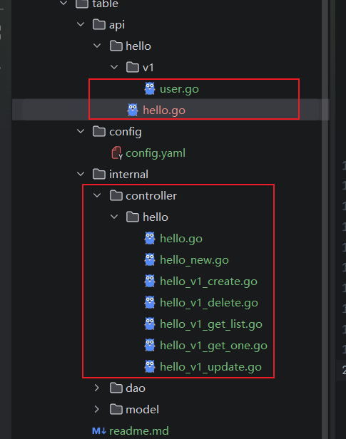
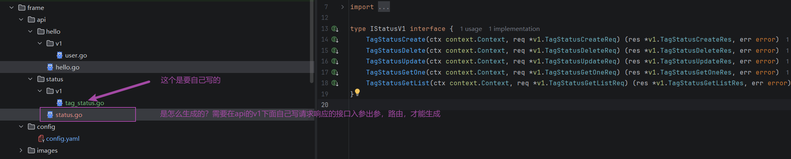
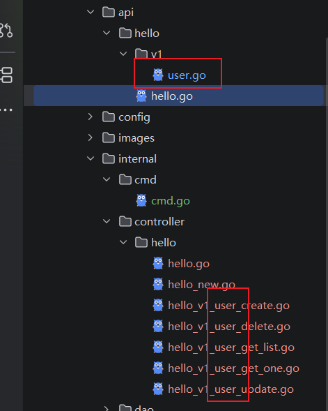
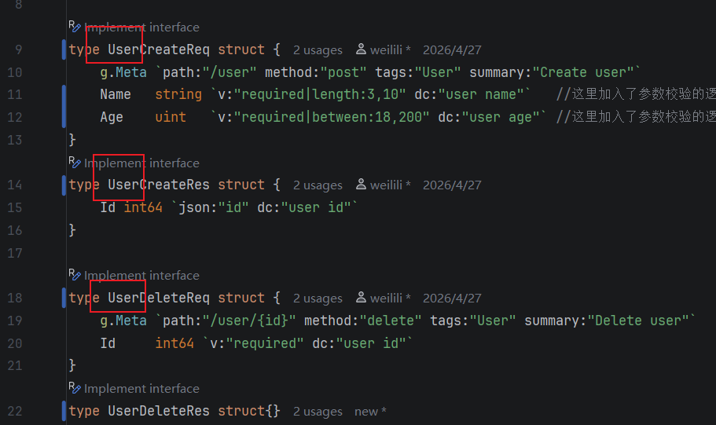

1、配置config文件,数据库建好表
2、执行，生成dao的数据库模型
```
gf gen dao
```

3、新建api文件，添加访问路由
4、生成controller层代码



-   yaml配置文件的相对路径
```
    srcFolder: "./table/api"
    dstFolder: "./table/internal/controller"
```
运行gf gen ctrl的前提是已经写好了api层的请求响应路由



-   运行命令gf gen ctrl生成controller层代码
```
    gf gen ctrl
```

如果想生成带有api/hello/v1/user的带有user前缀的代码，需要请求前面有完整的user前缀




接口数据先更新表，再调用api，不再依赖于接口推送结果
推送失败要有一定的重试机制
轮询机制判断下游服务是否异常，隔一段时间check状态
最差的情况要有人工的介入
监控--告警

K8s内部健康检查(K8s自动调用，无需配置)
http://10.244.0.5:8080/health/

集群内其他服务(通过 Service 名称访问)
http://goframe-service:80/health/

外部用户(通过域名访问（需要DNS解析）)
http://api.example.com/health/


K8s会自动请求:http://<Pod-IP>:8080/health/
```dockerignore
apiVersion: apps/v1
kind: Deployment
metadata:
  name: goframe-app
spec:
  replicas: 3
  template:
    spec:
      containers:
        - name: goframe-app
          image: your-app:latest
          ports:
            - containerPort: 8080  # ← K8s 知道容器监听 8080 端口
          
          livenessProbe:
            httpGet:
              path: /health/       # ← K8s 知道检查这个路径
              port: 8080           # ← K8s 知道访问这个端口
            periodSeconds: 5

```
外部访问你的服务，运维还需要配置 Service 和 Ingress。
service.yaml
```dockerignore
apiVersion: v1
kind: Service
metadata:
  name: goframe-service
spec:
  selector:
    app: goframe-app
  ports:
    - protocol: TCP
      port: 80           # 外部访问端口
      targetPort: 8080   # 转发到容器的 8080 端口
  type: ClusterIP        # 集群内部访问

```
ingress.yaml
```dockerignore
apiVersion: networking.k8s.io/v1
kind: Ingress
metadata:
  name: goframe-ingress
spec:
  rules:
    - host: api.example.com  # ← 域名
      http:
        paths:
          - path: /
            pathType: Prefix
            backend:
              service:
                name: goframe-service
                port:
                  number: 80

```


```dockerignore
    package dao
    //// UserKey 登录用户信息的context key
    //type UserKey struct{}
    //
    //// TenantKey 租户（渠道）信息的context key
    //type TenantKey struct{}
    //
    //// WithUser 将登录用户信息存入context
    //func WithUser(ctx context.Context, user *entity.User) context.Context {
    //	return context.WithValue(ctx, UserKey{}, user)
    //}
    //
    //// GetUser 从context获取登录用户信息
    //func GetUser(ctx context.Context) (*entity.User, bool) {
    //	user, ok := ctx.Value(UserKey{}).(*entity.User)
    //	return user, ok
    //}
    //
    //// WithTenant 将租户（渠道）信息存入context
    //func WithTenant(ctx context.Context, tenantId int64) context.Context {
    //	return context.WithValue(ctx, TenantKey{}, tenantId)
    //}
    //
    //// GetTenant 从context获取租户（渠道）信息
    //func GetTenant(ctx context.Context) (int64, bool) {
    //	tenantId, ok := ctx.Value(TenantKey{}).(int64)
    //	return tenantId, ok
    //}
```
